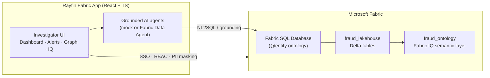
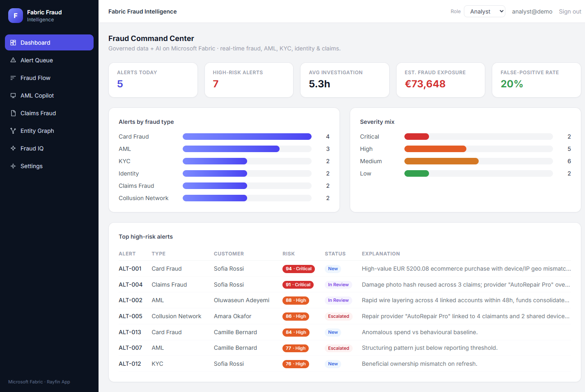
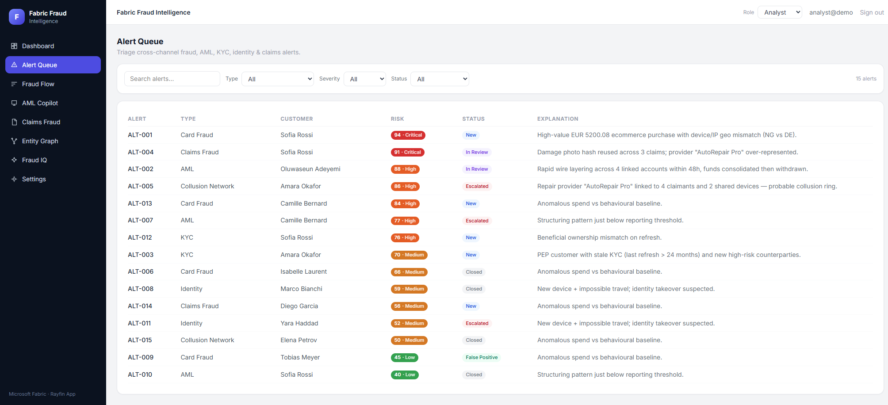
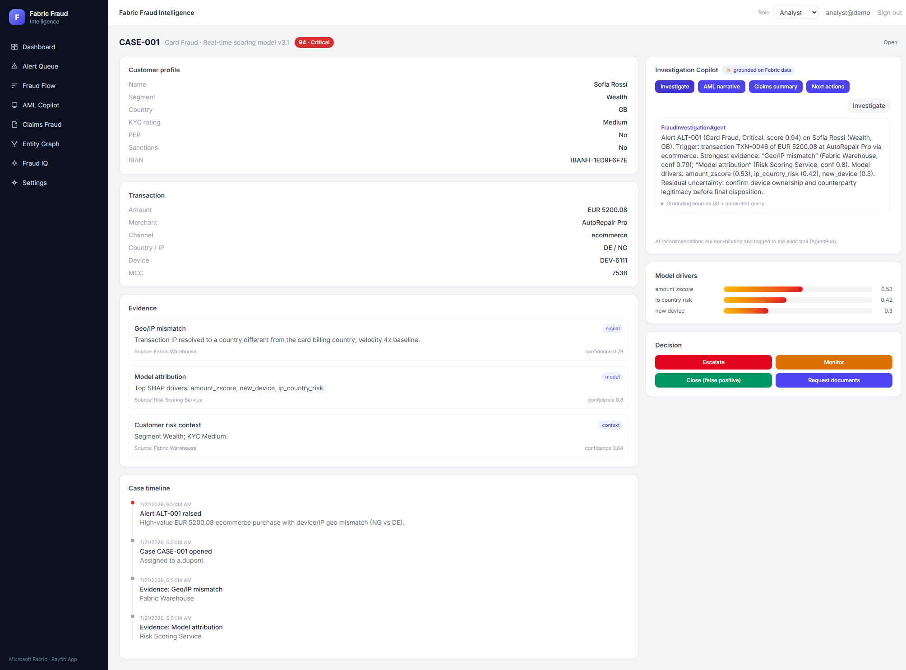
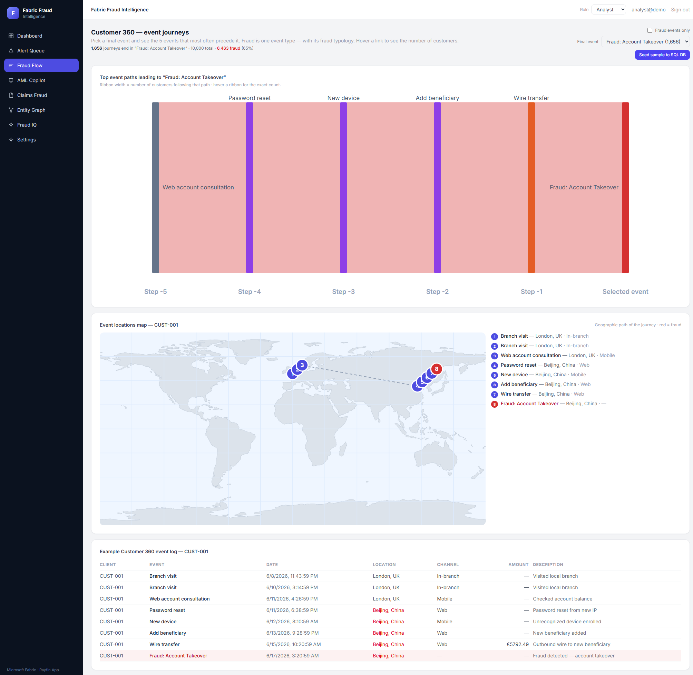
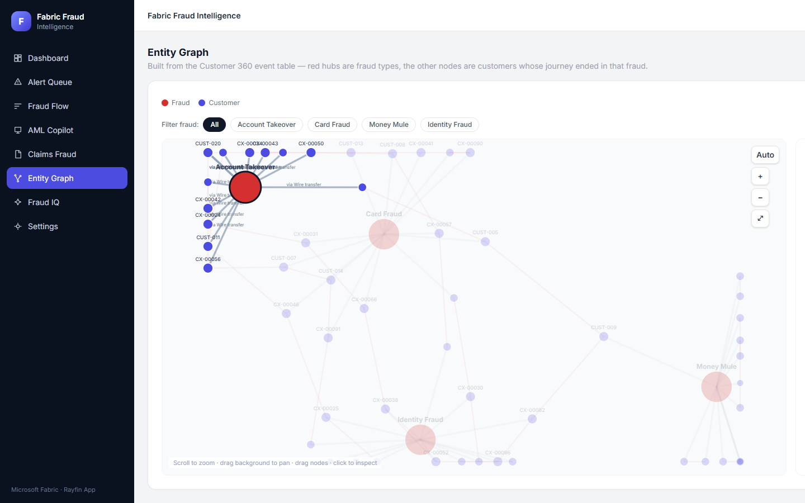
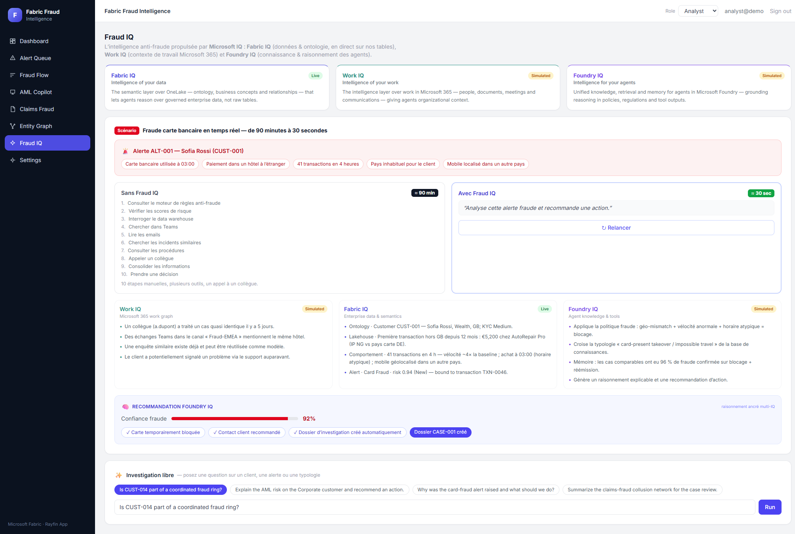
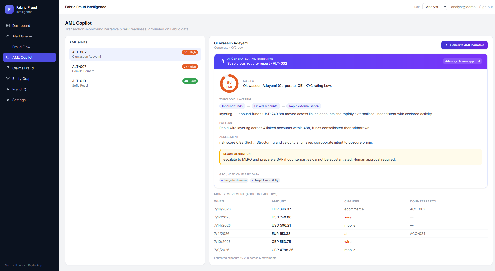
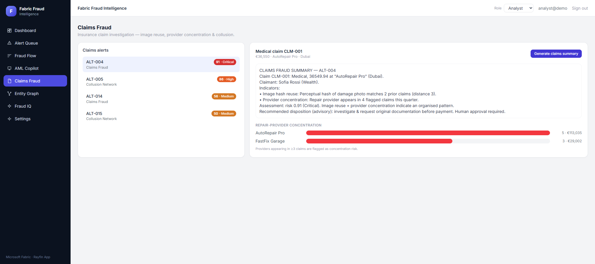
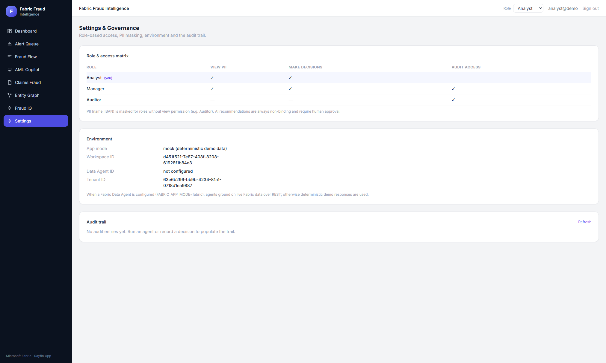

# Fabric Fraud Intelligence

An end-to-end fraud detection and investigation solution built on **Microsoft Fabric**,
combining a **Rayfin Fabric App** (React frontend + Fabric SQL backend), a governed
**Lakehouse**, and a **Fabric IQ Ontology** semantic layer.

**Live app:** https://fleet-north-8c279cc767-swedencentral.webapp.fabricapps.net
**Workspace:** `Fraud_analysis` (`d451f521-7e87-408f-8208-61928f1b84e3`)

## Repository structure

| Folder | Theme | Contents |
| --- | --- | --- |
| `fabric-fraud-intelligence/` | **Application** | Rayfin Fabric App — React/TS frontend, entity models, mock agent services. Deploy with `npx rayfin up`. |
| `fabric/ontology/` | **Semantic layer** | Fabric IQ Ontology builder (`build_ontology.py`), REST deployer (`post_ontology.ps1`), generated `create_body.json` + `parts/`, and `fraud_ontology.yaml` (deployed model doc). |
| `fabric/lakehouse/` | **Data** | Loads the app dataset into `fraud_lakehouse` Delta tables (`load_app_data.py`, `run_load.ps1`, `upload_lakehouse_data.ps1`, `post_notebook.ps1`) + historical SQL. |
| `fabric/realtime/` | **Streaming** | Eventhouse/KQL specs and deploy scripts. |
| `fabric/powerbi/` | **Reporting** | Semantic model (`model.bim`) + report deploy scripts. |
| `design/` | **Architecture blueprint** | Canonical contracts, fraud patterns, risk-scoring spec, screen UX contracts, remediation loop, environment config. |
| `docs/` | **Docs** | Executive demo narrative and supporting documentation. |

## The Rayfin application

The app in `fabric-fraud-intelligence/` is a **Fabric App** built with the
**Rayfin** SDK/CLI — Microsoft's framework for shipping data-centric applications
that run *inside* Microsoft Fabric. Rayfin turns a set of TypeScript `@entity`
classes into a governed **Fabric SQL Database** (the ontology / system of record),
exposes a typed data client to the frontend, and handles **Fabric SSO** (Microsoft
Entra ID) so the deployed app authenticates against the tenant with no custom
identity code.

On top of that foundation, the app is a **fraud investigator's workbench** for
banking & insurance. It demonstrates Microsoft Fabric as a *governed data + AI
application platform*, covering the full fraud lifecycle: **card/payment fraud,
AML alert investigation, KYC refresh, insurance claims fraud, identity fraud and
provider/collusion network fraud.**

### How it fits together



- **`rayfin/data/*.ts`** — `@entity` models (Customer, Account, Transaction,
  FraudAlert, FraudCase, Claim, Policy, Evidence, EntityRelationship, AgentRun,
  CustomerEvent). These materialize as the Fabric SQL Database on `rayfin up`.
- **`src/backend/`** — domain models with **RBAC + PII masking** helpers, service
  clients (`FabricDataAgentClient`, `FabricWarehouseClient`, `RiskScoringService`,
  `AuditService`) and an **AgentOrchestrator** with regulator-safe prompt templates.
- **`src/app/`** — the React UI: router + auth guard, a **role provider**
  (Analyst / Manager / Auditor), and the screens below.
- **Grounding modes** — by default agents run in **mock mode** with deterministic,
  grounded responses from the seeded data (plus a generated NL2SQL query). Set
  `FABRIC_APP_MODE=fabric` with a `FABRIC_DATA_AGENT_ID` to route to a **live
  Fabric Data Agent** over REST. Every agent run and decision is written to the
  **AgentRun** entity and the **audit trail**, and all AI output is advisory —
  **human approval is always required.**

### Screens

#### Dashboard — Fraud Command Center
KPIs (alerts today, high-risk alerts, average investigation time, estimated fraud
exposure, false-positive rate), alerts broken down by fraud type and severity, and
a ranked table of the top high-risk alerts with risk scores and explanations.



#### Alert Queue
The working list of open alerts across every fraud type, with risk scoring,
severity and status — the analyst's entry point into a case.



#### Case Detail
A single investigation view: alert context, customer 360, a case timeline, an
evidence panel, and a grounded **agent chat** that can investigate the alert and
suggest next actions. Decisions (escalate / close / request documents) are explicit
and logged.



#### Fraud Flow — Customer 360 event journeys
A Sankey of customer journeys: pick a final event and see the five events that most
often precede it, with a fraud-only filter and hover counts. A geographic **event
map** and an example **Customer 360 event log** ground each journey in real data.



#### Entity Graph
An event-derived, force-directed graph where **red hubs are fraud typologies** and
the surrounding nodes are the customers whose journey ended in that fraud. Nodes are
sized by **centrality** (degree / closeness / betweenness), can be filtered by fraud
type, and clicking a node produces an **AI narrative** explaining the entity's role
and key risk signals.



#### Fraud IQ — the fraud application of Microsoft IQ
A flagship **"90 min → 30 sec"** real-time card-fraud scenario plus free-form
investigation, combining the three IQs: **Fabric IQ** (live, from the deployed
ontology + lakehouse), **Work IQ** and **Foundry IQ** (simulated). It contrasts the
manual, 10-step investigation with a single agentic prompt that grounds across
enterprise data, work context and agent knowledge, then returns an explainable,
human-approvable recommendation.



#### AML Copilot
Transaction-monitoring narrative and **SAR readiness**, grounded on Fabric data:
select an AML alert, generate a structured suspicious-activity narrative (subject,
typology, pattern, assessment, recommendation) and inspect the underlying
money-movement wires.



#### Claims Fraud
Insurance claim investigation — perceptual **image-hash reuse**, repair-provider
**concentration** and collusion. Generate a claims-fraud summary and review the
provider-concentration bars that expose organised rings.



#### Settings & Governance
The **role & access matrix** (View PII / Make decisions / Audit access per role),
environment configuration (app mode, workspace, Data Agent, tenant), and the
**audit trail** of every agent run and decision.



### Run locally

```powershell
cd fabric-fraud-intelligence
npm install
npm run dev
```

> Local dev uses a mock auth service and deterministic seed data, so no Fabric
> connection is required to explore the UI.

### Deploy to Fabric

```powershell
cd fabric-fraud-intelligence
npx rayfin up --workspace "Fraud_analysis"
```

On deploy, the `@entity` models materialize as a **Fabric SQL Database** item (the
ontology) with a free **SQL analytics endpoint** any Power BI report can query, and
the app authenticates users with **Fabric SSO**.

## The data + semantic layer

`fraud_lakehouse` holds 11 governed Delta tables (customer, account, transaction, policy,
claim, fraud_alert, fraud_case, evidence, entity_relationship, agent_run, customer_event).
The **`fraud_ontology`** Fabric IQ item binds those tables into 11 entity types and 11
relationship types, deriving an instance graph from foreign-key columns.

```powershell
# 1. materialize app data as Delta tables
& fabric/lakehouse/run_load.ps1
# 2. build + deploy the ontology
python fabric/ontology/build_ontology.py
& fabric/ontology/post_ontology.ps1
```

## Demo

See [docs/exec-demo-narrative.md](docs/exec-demo-narrative.md) for the executive demo script.
