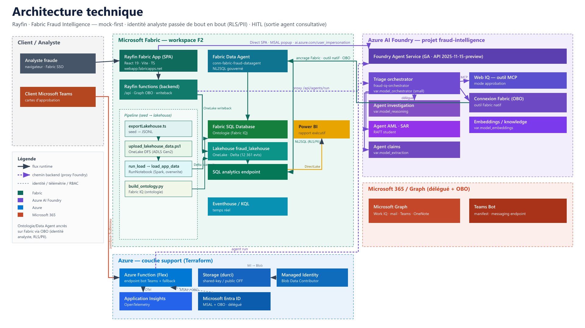
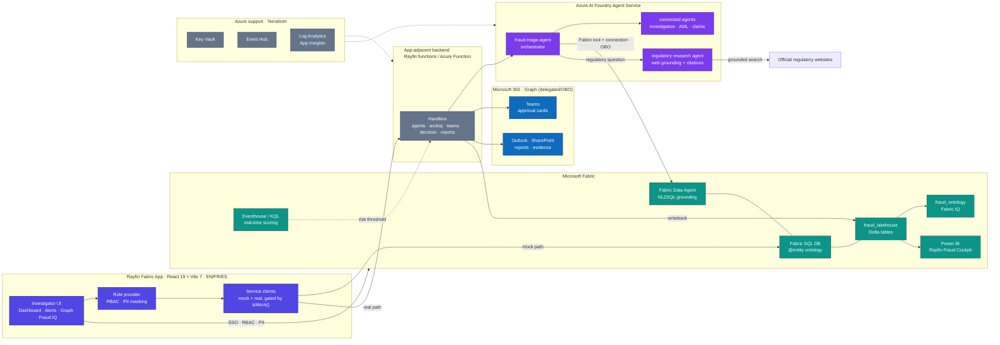
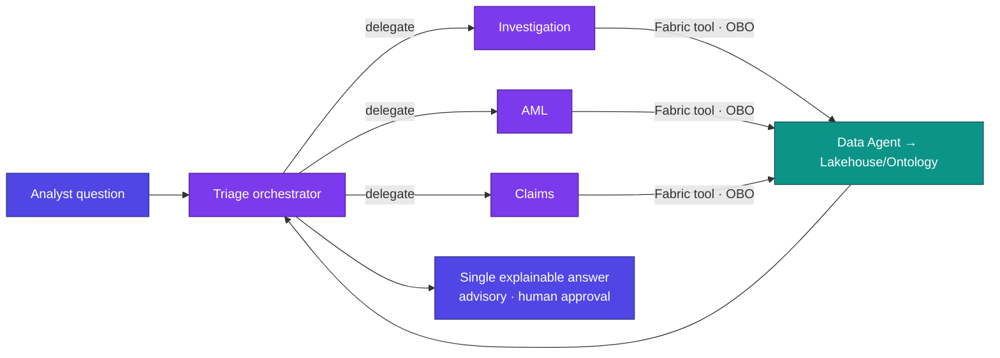
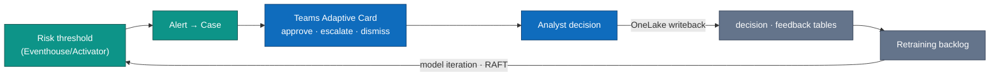

# Fabric Fraud Intelligence



> Architecture technique et flux de bout en bout (source éditable : [docs/architecture.drawio](docs/architecture.drawio) · vectoriel : [docs/images/architecture.svg](docs/images/architecture.svg)).

An end-to-end fraud detection and investigation solution built on **Microsoft Fabric**,
combining a **Rayfin Fabric App** (React frontend + Fabric SQL backend), a governed
**Lakehouse**, and a **Fabric IQ Ontology** semantic layer.

**Public demo:** https://tangy-cove-9493188f6d-centralus.webapp.fabricapps.net
**Workspace:** `Fraud Intelligence` (`c57a379b-7e6d-481a-9c9b-662bb0bae77d`)
**Microsoft Foundry project:** [FraudIQ](https://ai.azure.com/nextgen/r/FyQciQyGSOm9599wsQw5qg,esig_demo,,esigfoundry,FraudIQ/home?tid=b7b9a0c6-fe36-41b6-a38d-582c6573e2ff) *(tenant authentication required)*

The public deployment runs exclusively on synthetic seed data and deterministic
agent responses. It does not grant anonymous access to the Fabric SQL database,
Lakehouse, Ontology, Data Agent, Eventhouse, semantic model, or report.

The current Fabric deployment includes the Rayfin app and SQL database, a Lakehouse
with 11 Delta tables, a load notebook, a Fabric IQ Ontology, a published Data Agent,
an Eventhouse with a KQL database, and Power BI semantic model and report items.
See [docs/DEPLOYMENT.md](docs/DEPLOYMENT.md) for the deployed item inventory,
repeatable deployment commands, validation steps, and current limitations.

An **extended integration layer** (mock-first, gated by config) adds **Azure AI Foundry
Agent Service** (connected agents grounded on Fabric via OBO), **Microsoft 365** (Teams
approval cards, Outlook, SharePoint, Work IQ signals over Microsoft Graph delegated/OBO),
a **closed remediation loop** (alert → case → OneLake writeback → retraining), and
**Terraform** for the Azure support layer. The UI is localized in **English, French and
Spanish**. See [docs/innovations-and-roadmap.md](docs/innovations-and-roadmap.md) for the
innovation highlights and the roadmap of evolutions still to build.

## Demo video


https://github.com/user-attachments/assets/ccec2599-2d85-422a-b76b-db16fc66f93f


> Full quality (with sound): **[Fabric Fraud Intelligence (live).mp4](https://raw.githubusercontent.com/EtienneSIG/Fabric_Fraud_analysis/main/video/Fabric%20Fraud%20Intelligence%20%28live%29.mp4)**

---

## Repository structure

| Folder | Theme | Contents |
| --- | --- | --- |
| `fabric-fraud-intelligence/` | **Application** | Rayfin Fabric App — React/TS frontend, entity models, mock agent services. Deploy with `npx rayfin up`. |
| `fabric/ontology/` | **Semantic layer** | Fabric IQ Ontology builder (`build_ontology.py`), REST deployer (`post_ontology.ps1`), generated `create_body.json` + `parts/`, and `fraud_ontology.yaml` (deployed model doc). |
| `fabric/data-agent/` | **AI grounding** | Idempotent Fabric Data Agent deployment grounded on the 11 `fraud_lakehouse` tables with fraud-specific instructions and few-shot SQL. |
| `foundry/` | **Agent orchestration** | Reproducible Foundry account, project, model, Fabric Data Agent connection, grounded agent and citation validation. |
| `fabric/lakehouse/` | **Data** | Loads the app dataset into `fraud_lakehouse` Delta tables (`load_app_data.py`, `run_load.ps1`, `upload_lakehouse_data.ps1`, `post_notebook.ps1`) + historical SQL. |
| `fabric/realtime/` | **Streaming** | Eventhouse/KQL specs and deploy scripts. |
| `fabric/powerbi/` | **Reporting** | Semantic model (`model.bim`) + report deploy scripts. |
| `design/` | **Architecture blueprint** | Canonical contracts, fraud patterns, risk-scoring spec, screen UX contracts, remediation loop, environment config. |
| `infra/terraform/` | **Infrastructure (IaC)** | Terraform for the Azure support layer — AI Foundry + model deployments, Key Vault, Event Hub, Log Analytics/App Insights, Azure Bot, Function App, delegated Graph app registration. |
| `backend/` | **App-adjacent backend** | Host-agnostic handlers (Foundry proxy, Graph OBO, Teams bot, OneLake writeback) + an Azure Functions wrapper for the Teams bot endpoint. |
| `foundry/agents/` | **Agent Service** | Deploys the Foundry connected-agent topology (triage → investigation / AML / claims) grounded on Fabric via a connection with OBO. |
| `foundry/raft/` | **RAFT (model iteration)** | Retrieval-Augmented Fine-Tuning notebooks (generate · fine-tune · deploy · eval), the versioned dataset and the evaluation harness that trains an AML student model and proves the gain. |
| `foundry/knowledge/` | **Foundry IQ** | Deploys the OneLake knowledge base over the fraud document corpus and wires it into the triage agents. |
| `fabric/lakehouse/corpus/` | **Document corpus** | The unstructured AML document corpus (training domain + distractors) RAFT reasons over, with manifest and idempotent upload. |
| `teams/` | **Teams app** | Side-loadable Teams app manifest for approval Adaptive Cards. |
| `.github/` | **Conventions** | Repo-wide + path-scoped Copilot instructions (architecture, i18n, naming, Terraform, Foundry agents). |
| `docs/` | **Docs** | Executive demo narrative, deployment guide, and the innovations & roadmap. |

## The Rayfin application

The app in `fabric-fraud-intelligence/` is a **Fabric App** built with the
**Rayfin** SDK/CLI — Microsoft's framework for shipping data-centric applications
that run *inside* Microsoft Fabric. Rayfin turns a set of TypeScript `@entity`
classes into a governed **Fabric SQL Database** (the ontology / system of record),
exposes a typed data client to the frontend, and handles **Fabric SSO** (Microsoft
Entra ID) so the deployed app authenticates against the tenant with no custom
identity code.

On top of that foundation, the app is a **fraud investigator's workbench** for
banking & insurance. It demonstrates Microsoft Fabric as a *governed data + AI
application platform*, covering the full fraud lifecycle: **card/payment fraud,
AML alert investigation, KYC refresh, insurance claims fraud, identity fraud and
provider/collusion network fraud.**

### How it fits together


```mermaid
flowchart LR
  classDef app fill:#4f46e5,color:#ffffff,stroke:#312e81,stroke-width:1px
  classDef fabric fill:#0d9488,color:#ffffff,stroke:#134e4a,stroke-width:1px
  classDef foundry fill:#7c3aed,color:#ffffff,stroke:#4c1d95,stroke-width:1px
  classDef o365 fill:#0f6cbd,color:#ffffff,stroke:#083b6f,stroke-width:1px
  classDef infra fill:#64748b,color:#ffffff,stroke:#334155,stroke-width:1px

  subgraph App["Rayfin Fabric App · React 19 + Vite 7 · EN/FR/ES"]
    UI["Investigator UI<br/>Dashboard · Alerts · Graph · Fraud IQ"]:::app
    GOV["Role provider<br/>RBAC · PII masking"]:::app
    SVC["Service clients<br/>mock + real, gated by isMock()"]:::app
  end

  subgraph Back["App-adjacent backend<br/>Rayfin functions / Azure Function"]
    API["Handlers<br/>agents · workiq · teams · decision · reports"]:::infra
  end

  subgraph Fabric["Microsoft Fabric"]
    SQL["Fabric SQL DB<br/>@entity ontology"]:::fabric
    LH["fraud_lakehouse<br/>Delta tables"]:::fabric
    ONT["fraud_ontology<br/>Fabric IQ"]:::fabric
    DA["Fabric Data Agent<br/>NL2SQL grounding"]:::fabric
    EH["Eventhouse / KQL<br/>real-time scoring"]:::fabric
    BI["Power BI<br/>Rayfin Fraud Cockpit"]:::fabric
  end
  subgraph Foundry["Azure AI Foundry Agent Service"]
    TRI["fraud-triage-agent<br/>orchestrator"]:::foundry
    SUB["connected agents<br/>investigation · AML · claims"]:::foundry
    REG["regulatory research agent<br/>web grounding + citations"]:::foundry
  end

  WEB["Official regulatory websites"]

  subgraph O365["Microsoft 365 · Graph (delegated/OBO)"]
    TEAMS["Teams<br/>approval cards"]:::o365
    MAIL["Outlook · SharePoint<br/>reports · evidence"]:::o365
  end

  subgraph Az["Azure support · Terraform"]
    KV["Key Vault"]:::infra
    EHNS["Event Hub"]:::infra
    OBS["Log Analytics<br/>App Insights"]:::infra
  end

  UI --> GOV --> SVC
  SVC -->|mock path| SQL
  SVC -->|real path| API
  API --> TRI --> SUB
  TRI -->|Fabric tool + connection · OBO| DA
  TRI -->|regulatory question| REG
  REG -->|grounded search| WEB
  DA --- SQL --- LH --> ONT
  LH --> BI
  EH -.->|risk threshold| API
  API --> TEAMS
  API --> MAIL
  API -->|writeback| LH
  Az -.-> Back
  Az -.-> Foundry
  UI -->|SSO · RBAC · PII| Fabric
```

### End-to-end flows

**Grounded multi-agent investigation** — the orchestrator is the only agent that replies;
sub-agents ground on Fabric with the analyst's identity so RLS and PII masking hold.


```mermaid
flowchart LR
  classDef a fill:#4f46e5,color:#fff,stroke:#312e81
  classDef f fill:#7c3aed,color:#fff,stroke:#4c1d95
  classDef d fill:#0d9488,color:#fff,stroke:#134e4a
  Q["Analyst question"]:::a --> T["Triage orchestrator"]:::f
  T -->|delegate| I["Investigation"]:::f
  T -->|delegate| M["AML"]:::f
  T -->|delegate| C["Claims"]:::f
  I & M & C -->|Fabric tool · OBO| G["Data Agent → Lakehouse/Ontology"]:::d
  G --> T
  T --> R["Single explainable answer<br/>advisory · human approval"]:::a
```

**Closed remediation loop** — a crossed risk threshold drives a human-in-the-loop decision
back into OneLake and the retraining backlog.


```mermaid
flowchart LR
  classDef e fill:#0d9488,color:#fff,stroke:#134e4a
  classDef o fill:#0f6cbd,color:#fff,stroke:#083b6f
  classDef l fill:#64748b,color:#fff,stroke:#334155
  TH["Risk threshold<br/>(Eventhouse/Activator)"]:::e --> AL["Alert → Case"]:::e
  AL --> CARD["Teams Adaptive Card<br/>approve · escalate · dismiss"]:::o
  CARD --> DEC["Analyst decision"]:::o
  DEC -->|OneLake writeback| WB["decision · feedback tables"]:::l
  WB --> RT["Retraining backlog"]:::l
  RT -->|model iteration · RAFT| TH
```

> The `model iteration` edge is now **solid**: RAFT (`foundry/raft/`) implements it — the
> retraining backlog seeds a fine-tuned AML student whose gain is measured against the baseline
> (`foundry/raft/eval/`) and surfaced live in the app. See
> [docs/raft-adaptation-brief.md](docs/raft-adaptation-brief.md).

- **`rayfin/data/*.ts`** — `@entity` models (Customer, Account, Transaction,
  FraudAlert, FraudCase, Claim, Policy, Evidence, EntityRelationship, AgentRun,
  CustomerEvent). These materialize as the Fabric SQL Database on `rayfin up`.
- **`src/backend/`** — domain models with **RBAC + PII masking** helpers, service
  clients (`FabricDataAgentClient`, `FabricWarehouseClient`, `RiskScoringService`,
  `AuditService`) and an **AgentOrchestrator** with regulator-safe prompt templates.
- **`src/app/`** — the React UI: router + auth guard, a **role provider**
  (Analyst / Manager / Auditor), and the screens below.
- **Grounding modes** — by default agents run in **mock mode** with deterministic,
  grounded responses from the seeded data (plus a generated NL2SQL query). Set
  `FABRIC_APP_MODE=fabric` with a `FABRIC_DATA_AGENT_ID` to route to a **live
  Fabric Data Agent** over REST. Every agent run and decision is written to the
  **AgentRun** entity and the **audit trail**, and all AI output is advisory —
  **human approval is always required.**
- **Foundry orchestration** — a companion agent built in **Microsoft Foundry** uses Web
  Search to retrieve current guidance from official regulatory websites. It treats case
  facts supplied in the prompt as unverified context and keeps source links in the answer
  so an investigator can verify the applicable obligation. The Fabric Data Agent remains
  separate and is not attached to this orchestrator.
  This Foundry flow is configured in the authenticated [FraudIQ Foundry project](https://ai.azure.com/nextgen/r/FyQciQyGSOm9599wsQw5qg,esig_demo,,esigfoundry,FraudIQ/home?tid=b7b9a0c6-fe36-41b6-a38d-582c6573e2ff)
  and is reproducible from `foundry/`; the public Rayfin demo currently represents
  its output with deterministic responses.

### Screens

#### Dashboard — Fraud Command Center
KPIs (alerts today, high-risk alerts, average investigation time, estimated fraud
exposure, false-positive rate), alerts broken down by fraud type and severity, and
a ranked table of the top high-risk alerts with risk scores and explanations.


#### Fraud Flow — Customer 360 event journeys
A Sankey of customer journeys: pick a final event and see the five events that most
often precede it, with a fraud-only filter and hover counts. A geographic **event
map** and an example **Customer 360 event log** ground each journey in real data.


#### Entity Graph
An event-derived, force-directed graph where **red hubs are fraud typologies** and
the surrounding nodes are the customers whose journey ended in that fraud. Nodes are
sized by **centrality** (degree / closeness / betweenness), can be filtered by fraud
type, and clicking a node produces an **AI narrative** explaining the entity's role
and key risk signals.


#### Fraud IQ — the fraud application of Microsoft IQ
A flagship **"90 min → 30 sec"** real-time card-fraud scenario plus free-form
investigation, combining the three IQs: **Fabric IQ** (live, from the deployed
ontology + lakehouse), **Work IQ** (simulated) and **Foundry IQ** (live through the
deployed `fraud-iq-orchestrator`). It contrasts the
manual, 10-step investigation with a single agentic prompt that grounds across
enterprise data, work context and agent knowledge, then returns an explainable,
human-approvable recommendation.


#### Alert Queue
The working list of open alerts across every fraud type, with risk scoring,
severity and status — the analyst's entry point into a case.


#### Case Detail
A single investigation view: alert context, customer 360, a case timeline, an
evidence panel, and a grounded **agent chat** that can investigate the alert and
suggest next actions. Decisions (escalate / close / request documents) are explicit
and logged.


#### AML Copilot
Transaction-monitoring narrative and **SAR readiness**, grounded on Fabric data:
select an AML alert, generate a structured suspicious-activity narrative (subject,
typology, pattern, assessment, recommendation) and inspect the underlying
money-movement wires.


#### Claims Fraud
Insurance claim investigation — perceptual **image-hash reuse**, repair-provider
**concentration** and collusion. Generate a claims-fraud summary and review the
provider-concentration bars that expose organised rings.


#### Fraud IQ — the fraud application of Microsoft IQ
A flagship **"90 min → 30 sec"** real-time card-fraud scenario plus free-form
investigation, combining the four IQs: **Fabric IQ** (live, from the deployed
ontology + lakehouse), **Work IQ** (simulated), **Foundry IQ** (implemented in
Foundry and represented by deterministic responses in this app) and **Web IQ**
(real-time regulatory web grounding, restricted to official domains, returning cited
obligations with source links). It contrasts the manual, 10-step investigation with a
single agentic prompt that grounds across enterprise data, work context, agent
knowledge and the live regulatory web, then returns an explainable, human-approvable
recommendation.


#### Settings & Governance
The **role & access matrix** (View PII / Make decisions / Audit access per role),
environment configuration (app mode, workspace, Data Agent, tenant), and the
**audit trail** of every agent run and decision. An **Agents** tab lets the analyst
select the **Foundry orchestrator agent** for the wired project and manage the
**Microsoft Web IQ** API key — both stored in the browser and passed to the backend
proxy per request.


### Run locally

```powershell
cd fabric-fraud-intelligence
npm install
npm run dev:demo   # UI only, fully offline (no backend, no Docker)
# or
npm run dev        # full stack: starts the Rayfin dev backend (needs Docker) + UI
```

> `dev:demo` runs Vite alone with a public demo auth service and deterministic seed
> data — the fastest way to explore the UI. `dev` also runs `rayfin up`, which starts
> the local Rayfin backend (SQL on `localhost:5168`) and requires Docker; if it isn't
> running, sign-in fails and the app stays on the login screen.

### Deploy to Fabric

```powershell
cd fabric-fraud-intelligence
npx rayfin up --workspace-id "c57a379b-7e6d-481a-9c9b-662bb0bae77d"
```

On deploy, the `@entity` models materialize as a **Fabric SQL Database** item (the
ontology) with a free **SQL analytics endpoint** any Power BI report can query, and
the app authenticates users with **Fabric SSO**.

## Microsoft Foundry

The authenticated [FraudIQ project](https://ai.azure.com/nextgen/r/FyQciQyGSOm9599wsQw5qg,esig_demo,,esigfoundry,FraudIQ/home?tid=b7b9a0c6-fe36-41b6-a38d-582c6573e2ff)
hosts the AI orchestration layer. It is deployed in the `esigfoundry` account in
East US and is reproducible from the source files under `foundry/`.

| Component | Deployed value | Purpose |
| --- | --- | --- |
| Prompt agent | `fraud-iq-orchestrator` | Grounds regulatory guidance on official web sources |
| Model deployment | `gpt-5.6-terra` | Runs the agent reasoning and tool orchestration |
| Web Search tool | France / Paris location | Retrieves current regulatory guidance with URL citations |
| Validation | Official-domain allow-list | Rejects missing citations and citations outside approved domains |

The agent follows this request flow:

1. Web Search looks up generic legal concepts, rules, dates, and thresholds.
2. The model treats case facts in the prompt as unverified context.
3. The model separates supplied facts, interpretation, applicable obligations, and actions.
4. The answer preserves regulatory URL citations.
5. Any filing, blocking, fraud, or customer decision remains subject to human approval.

Approved regulatory sources include the ACPR, AMF, Banque de France, CNIL, EBA,
European Commission, EUR-Lex, FATF/GAFI, Legifrance, the French Ministry of Justice,
and the French Ministry of the Economy. The complete versioned allow-list is in
`foundry/config.json`. Personal data and case evidence must never be included in a
web-search query.

Deploy or update the full Foundry layer from the repository root:

```powershell
az login --tenant "<tenant-id>"
& foundry/deploy_foundry.ps1 `
  -SubscriptionId "<subscription-id>" `
  -ResourceGroup "esig_demo" `
  -Location "eastus"
```

The deployment is idempotent. It provisions the account and project when needed,
reconciles the five model deployments declared in `foundry/models.json`, creates the
delegated Fabric MCP connection for separate consumers, publishes a new immutable web-only
agent version, and validates the regulatory grounding. Use `-SkipInfrastructure` to retain
the account and project, or `-SkipModels` to leave existing model deployments untouched.

Consumers that separately attach the Fabric connection can require interactive delegated
consent and access to the Fabric workspace, Data Agent, and Lakehouse. The orchestrator's
web-only regulatory validation is independent of Fabric consent and is run with:

```powershell
& foundry/.venv/Scripts/python.exe foundry/validate_foundry.py `
  --endpoint "https://esigfoundry.services.ai.azure.com/api/projects/FraudIQ" `
  --config foundry/config.json
```

See [foundry/README.md](foundry/README.md) for prerequisites, model-only deployment,
consent handling, and the server-side domain-restriction option.

## The data + semantic layer

`fraud_lakehouse` holds 11 governed Delta tables (customer, account, transaction, policy,
claim, fraud_alert, fraud_case, evidence, entity_relationship, agent_run, customer_event).
The **`fraud_ontology`** Fabric IQ item binds those tables into 11 entity types and 11
relationship types, deriving an instance graph from foreign-key columns.

The published **`Fraud Intelligence Data Agent`** (`5e157d5a-2694-499b-9b9f-ed10fe73cb5a`)
is grounded on the same lakehouse. Its published configuration selects the 11 tables,
enforces evidence-based and human-in-the-loop answers, and includes fraud-specific SQL
examples. The public Fabric REST API manages its lifecycle and grounding configuration;
it does not currently expose a conversation endpoint, so the embedded app keeps its
deterministic fallback for in-app agent responses.

### Example prompts

Use the **Fabric Data Agent** for questions that can be answered exclusively from
the governed Lakehouse data:

```text
Quels sont les dix signaux de fraude les plus risqués ? Pour chaque alerte, donne
l'identifiant, le type, le score, la sévérité, le statut et les faits justificatifs.

Quels dossiers ouverts faut-il traiter en priorité ? Classe-les par score de risque
et indique l'analyste assigné ainsi que l'identifiant de l'alerte associée.

Quels réparateurs concentrent le plus de sinistres ? Compare le nombre de dossiers,
le montant total réclamé et les éléments de preuve disponibles.

Pour le client associé à l'alerte la plus risquée, reconstitue la chronologie des
transactions et événements disponibles. Signale explicitement toute donnée manquante.
```

Use the **`fraud-iq-orchestrator` agent in Microsoft Foundry** for current regulatory
guidance from official sources. Include any relevant case facts in the prompt and treat
them as unverified until an analyst checks them against Fabric:

```text
À partir des faits AML fournis dans la demande, distingue le contexte non vérifié,
les obligations réglementaires européennes applicables et les actions à soumettre
à validation humaine. Cite les textes officiels.

Analyse les signaux d'une possible fraude au paiement dans le dossier sélectionné.
Rapproche-les des exigences réglementaires en vigueur, cite uniquement des sources
officielles et indique clairement ce que les données ne permettent pas de conclure.

Pour les sinistres liés au réparateur le plus concentré, résume les éléments factuels,
recherche les obligations françaises pertinentes en matière de lutte contre la fraude
et propose les prochaines vérifications sans prendre de décision finale.

Quelles sont les obligations réglementaires européennes actuellement applicables en
matière de détection et de déclaration des opérations suspectes ? Cite uniquement des
sources officielles et précise la date de chaque texte utilisé.
```

Do not place personal data, account numbers, transaction details, or case evidence in
the regulatory-search portion of a prompt. The Foundry agent retrieves case facts from
Fabric and uses only generic legal concepts, rules, dates, and thresholds for web search.

```powershell
# 1. materialize app data as Delta tables
& fabric/lakehouse/run_load.ps1
# 2. build + deploy the ontology
python fabric/ontology/build_ontology.py `
  --workspace-id "c57a379b-7e6d-481a-9c9b-662bb0bae77d" `
  --lakehouse-id "257366a1-4675-4c66-a69e-1ec7ab653706"
& fabric/ontology/post_ontology.ps1 `
  -Ws "c57a379b-7e6d-481a-9c9b-662bb0bae77d" `
  -TenantId "<tenant-id>"

# 3. create or update the published Data Agent
& fabric/data-agent/deploy_data_agent.ps1 `
  -WorkspaceId "c57a379b-7e6d-481a-9c9b-662bb0bae77d" `
  -LakehouseId "257366a1-4675-4c66-a69e-1ec7ab653706"
```

## Demo

- **Live walkthrough:** see the demo video at the top of this README.
- **Integrated executive demo:** [docs/exec-demo-narrative.md](docs/exec-demo-narrative.md) (FR) and [docs/exec-demo-narrative.en.md](docs/exec-demo-narrative.en.md) (EN).
- **Fabric-focused executive demo:** [docs/exec-demo-narrative-fabric.md](docs/exec-demo-narrative-fabric.md) (FR).
- **Foundry-focused executive demo:** [docs/exec-demo-narrative-foundry.md](docs/exec-demo-narrative-foundry.md) (FR).
