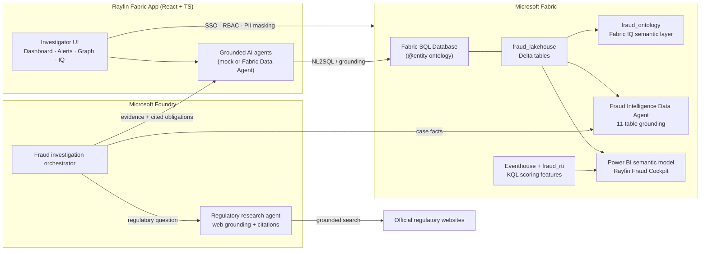
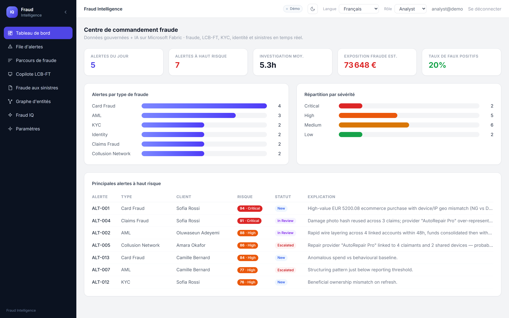
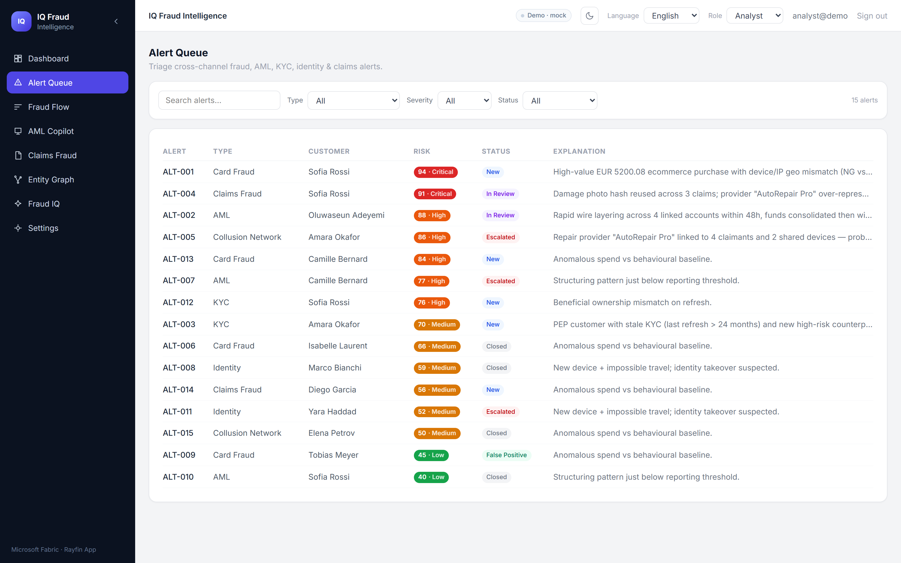
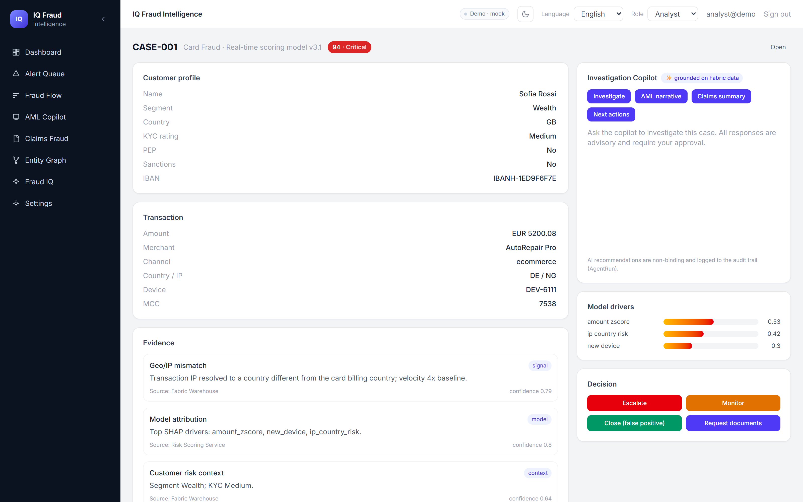
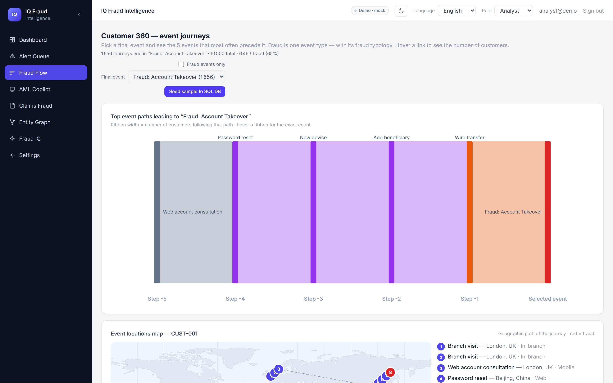
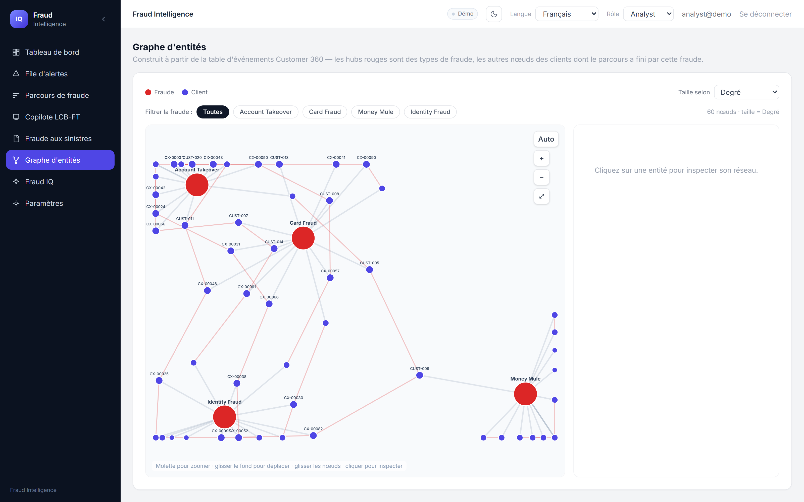
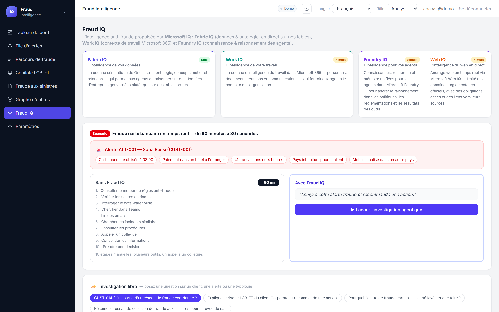
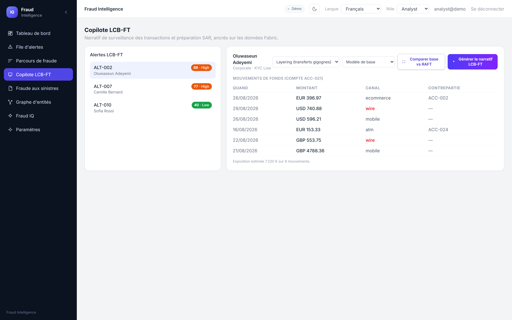
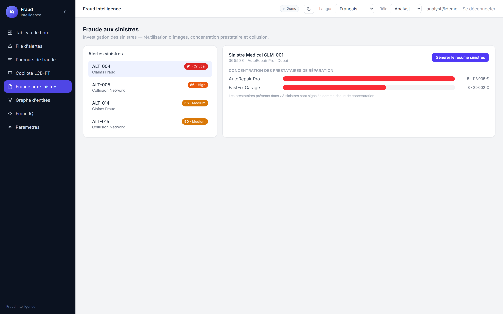
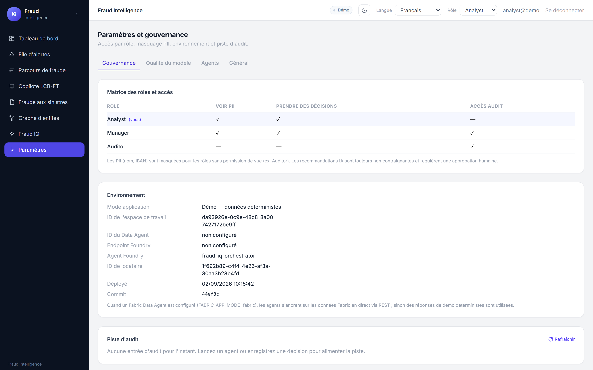

# Fabric Fraud Intelligence

An end-to-end fraud detection and investigation solution built on **Microsoft Fabric**,
combining a **Rayfin Fabric App** (React frontend + Fabric SQL backend), a governed
**Lakehouse**, and a **Fabric IQ Ontology** semantic layer.

**Public demo:** https://tangy-cove-9493188f6d-centralus.webapp.fabricapps.net
**Workspace:** `Fraud Intelligence` (`c57a379b-7e6d-481a-9c9b-662bb0bae77d`)
**Microsoft Foundry project:** [FraudIQ](https://ai.azure.com/nextgen/r/FyQciQyGSOm9599wsQw5qg,esig_demo,,esigfoundry,FraudIQ/home?tid=b7b9a0c6-fe36-41b6-a38d-582c6573e2ff) *(tenant authentication required)*

The public deployment runs exclusively on synthetic seed data and deterministic
agent responses. It does not grant anonymous access to the Fabric SQL database,
Lakehouse, Ontology, Data Agent, Eventhouse, semantic model, or report.

The current Fabric deployment includes the Rayfin app and SQL database, a Lakehouse
with 11 Delta tables, a load notebook, a Fabric IQ Ontology, a published Data Agent,
an Eventhouse with a KQL database, and Power BI semantic model and report items.
See [docs/DEPLOYMENT.md](docs/DEPLOYMENT.md) for the deployed item inventory,
repeatable deployment commands, validation steps, and current limitations.

## Demo video


https://github.com/user-attachments/assets/ccec2599-2d85-422a-b76b-db16fc66f93f


> Full quality (with sound): **[Fabric Fraud Intelligence (live).mp4](https://raw.githubusercontent.com/EtienneSIG/Fabric_Fraud_analysis/main/video/Fabric%20Fraud%20Intelligence%20%28live%29.mp4)**

---

## Repository structure

| Folder | Theme | Contents |
| --- | --- | --- |
| `fabric-fraud-intelligence/` | **Application** | Rayfin Fabric App — React/TS frontend, entity models, mock agent services. Deploy with `npx rayfin up`. |
| `fabric/ontology/` | **Semantic layer** | Fabric IQ Ontology builder (`build_ontology.py`), REST deployer (`post_ontology.ps1`), generated `create_body.json` + `parts/`, and `fraud_ontology.yaml` (deployed model doc). |
| `fabric/data-agent/` | **AI grounding** | Idempotent Fabric Data Agent deployment grounded on the 11 `fraud_lakehouse` tables with fraud-specific instructions and few-shot SQL. |
| `foundry/` | **Agent orchestration** | Reproducible Foundry account, project, model, Fabric Data Agent connection, grounded agent and citation validation. |
| `fabric/lakehouse/` | **Data** | Loads the app dataset into `fraud_lakehouse` Delta tables (`load_app_data.py`, `run_load.ps1`, `upload_lakehouse_data.ps1`, `post_notebook.ps1`) + historical SQL. |
| `fabric/realtime/` | **Streaming** | Eventhouse/KQL specs and deploy scripts. |
| `fabric/powerbi/` | **Reporting** | Semantic model (`model.bim`) + report deploy scripts. |
| `design/` | **Architecture blueprint** | Canonical contracts, fraud patterns, risk-scoring spec, screen UX contracts, remediation loop, environment config. |
| `docs/` | **Docs** | Executive demo narrative and supporting documentation. |

## The Rayfin application

The app in `fabric-fraud-intelligence/` is a **Fabric App** built with the
**Rayfin** SDK/CLI — Microsoft's framework for shipping data-centric applications
that run *inside* Microsoft Fabric. Rayfin turns a set of TypeScript `@entity`
classes into a governed **Fabric SQL Database** (the ontology / system of record),
exposes a typed data client to the frontend, and handles **Fabric SSO** (Microsoft
Entra ID) so the deployed app authenticates against the tenant with no custom
identity code.

On top of that foundation, the app is a **fraud investigator's workbench** for
banking & insurance. It demonstrates Microsoft Fabric as a *governed data + AI
application platform*, covering the full fraud lifecycle: **card/payment fraud,
AML alert investigation, KYC refresh, insurance claims fraud, identity fraud and
provider/collusion network fraud.**

### How it fits together


```mermaid
flowchart LR
  subgraph App["Rayfin Fabric App (React + TS)"]
    UI["Investigator UI<br/>Dashboard · Alerts · Graph · IQ"]
    AG["Grounded AI agents<br/>(mock or Fabric Data Agent)"]
  end
  subgraph Fabric["Microsoft Fabric"]
    SQL["Fabric SQL Database<br/>(@entity ontology)"]
    LH["fraud_lakehouse<br/>Delta tables"]
    ONT["fraud_ontology<br/>Fabric IQ semantic layer"]
    DA["Fraud Intelligence Data Agent<br/>11-table grounding"]
    RT["Eventhouse + fraud_rti<br/>KQL scoring features"]
    BI["Power BI semantic model<br/>Rayfin Fraud Cockpit"]
  end
  subgraph Foundry["Microsoft Foundry"]
    ORCH["Fraud investigation orchestrator"]
    REG["Regulatory research agent<br/>web grounding + citations"]
  end
  WEB["Official regulatory websites"]
  UI --> AG
  AG -->|NL2SQL / grounding| SQL
  ORCH -->|case facts| DA
  ORCH -->|regulatory question| REG
  REG -->|grounded search| WEB
  ORCH -->|evidence + cited obligations| AG
  SQL --- LH
  LH --> ONT
  LH --> DA
  RT --> BI
  LH --> BI
  UI -->|SSO · RBAC · PII masking| Fabric
```

- **`rayfin/data/*.ts`** — `@entity` models (Customer, Account, Transaction,
  FraudAlert, FraudCase, Claim, Policy, Evidence, EntityRelationship, AgentRun,
  CustomerEvent). These materialize as the Fabric SQL Database on `rayfin up`.
- **`src/backend/`** — domain models with **RBAC + PII masking** helpers, service
  clients (`FabricDataAgentClient`, `FabricWarehouseClient`, `RiskScoringService`,
  `AuditService`) and an **AgentOrchestrator** with regulator-safe prompt templates.
- **`src/app/`** — the React UI: router + auth guard, a **role provider**
  (Analyst / Manager / Auditor), and the screens below.
- **Grounding modes** — by default agents run in **mock mode** with deterministic,
  grounded responses from the seeded data (plus a generated NL2SQL query). Set
  `FABRIC_APP_MODE=fabric` with a `FABRIC_DATA_AGENT_ID` to route to a **live
  Fabric Data Agent** over REST. Every agent run and decision is written to the
  **AgentRun** entity and the **audit trail**, and all AI output is advisory —
  **human approval is always required.**
- **Foundry orchestration** — a companion agent built in **Microsoft Foundry** links
  two grounded specialists: the Fabric Data Agent retrieves governed case facts
  from the lakehouse, while a regulatory research agent uses web grounding against
  official regulatory websites. The orchestrator reconciles both outputs and keeps
  source links in the answer so an investigator can verify the applicable obligation.
  This Foundry flow is configured in the authenticated [FraudIQ Foundry project](https://ai.azure.com/nextgen/r/FyQciQyGSOm9599wsQw5qg,esig_demo,,esigfoundry,FraudIQ/home?tid=b7b9a0c6-fe36-41b6-a38d-582c6573e2ff)
  and is reproducible from `foundry/`; the public Rayfin demo currently represents
  its output with deterministic responses.

### Screens

#### Dashboard — Fraud Command Center
KPIs (alerts today, high-risk alerts, average investigation time, estimated fraud
exposure, false-positive rate), alerts broken down by fraud type and severity, and
a ranked table of the top high-risk alerts with risk scores and explanations.



#### Alert Queue
The working list of open alerts across every fraud type, with risk scoring,
severity and status — the analyst's entry point into a case.



#### Case Detail
A single investigation view: alert context, customer 360, a case timeline, an
evidence panel, and a grounded **agent chat** that can investigate the alert and
suggest next actions. Decisions (escalate / close / request documents) are explicit
and logged.



#### Fraud Flow — Customer 360 event journeys
A Sankey of customer journeys: pick a final event and see the five events that most
often precede it, with a fraud-only filter and hover counts. A geographic **event
map** and an example **Customer 360 event log** ground each journey in real data.



#### Entity Graph
An event-derived, force-directed graph where **red hubs are fraud typologies** and
the surrounding nodes are the customers whose journey ended in that fraud. Nodes are
sized by **centrality** (degree / closeness / betweenness), can be filtered by fraud
type, and clicking a node produces an **AI narrative** explaining the entity's role
and key risk signals.



#### Fraud IQ — the fraud application of Microsoft IQ
A flagship **"90 min → 30 sec"** real-time card-fraud scenario plus free-form
investigation, combining the three IQs: **Fabric IQ** (live, from the deployed
ontology + lakehouse), **Work IQ** (simulated) and **Foundry IQ** (implemented in
Foundry and represented by deterministic responses in this app). It contrasts the
manual, 10-step investigation with a single agentic prompt that grounds across
enterprise data, work context and agent knowledge, then returns an explainable,
human-approvable recommendation.



#### AML Copilot
Transaction-monitoring narrative and **SAR readiness**, grounded on Fabric data:
select an AML alert, generate a structured suspicious-activity narrative (subject,
typology, pattern, assessment, recommendation) and inspect the underlying
money-movement wires.



#### Claims Fraud
Insurance claim investigation — perceptual **image-hash reuse**, repair-provider
**concentration** and collusion. Generate a claims-fraud summary and review the
provider-concentration bars that expose organised rings.



#### Settings & Governance
The **role & access matrix** (View PII / Make decisions / Audit access per role),
environment configuration (app mode, workspace, Data Agent, tenant), and the
**audit trail** of every agent run and decision.



### Run locally

```powershell
cd fabric-fraud-intelligence
npm install
npm run dev
```

> Local dev uses a mock auth service and deterministic seed data, so no Fabric
> connection is required to explore the UI.

### Deploy to Fabric

```powershell
cd fabric-fraud-intelligence
npx rayfin up --workspace-id "c57a379b-7e6d-481a-9c9b-662bb0bae77d"
```

On deploy, the `@entity` models materialize as a **Fabric SQL Database** item (the
ontology) with a free **SQL analytics endpoint** any Power BI report can query, and
the app authenticates users with **Fabric SSO**.

## The data + semantic layer

`fraud_lakehouse` holds 11 governed Delta tables (customer, account, transaction, policy,
claim, fraud_alert, fraud_case, evidence, entity_relationship, agent_run, customer_event).
The **`fraud_ontology`** Fabric IQ item binds those tables into 11 entity types and 11
relationship types, deriving an instance graph from foreign-key columns.

The published **`Fraud Intelligence Data Agent`** (`5e157d5a-2694-499b-9b9f-ed10fe73cb5a`)
is grounded on the same lakehouse. Its published configuration selects the 11 tables,
enforces evidence-based and human-in-the-loop answers, and includes fraud-specific SQL
examples. The public Fabric REST API manages its lifecycle and grounding configuration;
it does not currently expose a conversation endpoint, so the embedded app keeps its
deterministic fallback for in-app agent responses.

### Example prompts

Use the **Fabric Data Agent** for questions that can be answered exclusively from
the governed Lakehouse data:

```text
Quels sont les dix signaux de fraude les plus risqués ? Pour chaque alerte, donne
l'identifiant, le type, le score, la sévérité, le statut et les faits justificatifs.

Quels dossiers ouverts faut-il traiter en priorité ? Classe-les par score de risque
et indique l'analyste assigné ainsi que l'identifiant de l'alerte associée.

Quels réparateurs concentrent le plus de sinistres ? Compare le nombre de dossiers,
le montant total réclamé et les éléments de preuve disponibles.

Pour le client associé à l'alerte la plus risquée, reconstitue la chronologie des
transactions et événements disponibles. Signale explicitement toute donnée manquante.
```

Use the **`fraud-iq-orchestrator` agent in Microsoft Foundry** when the answer must
combine governed Fabric facts with current regulatory guidance from official sources:

```text
Pour le dossier AML ouvert le plus risqué, distingue les faits disponibles dans
Fabric, les obligations réglementaires européennes applicables et les actions à
soumettre à validation humaine. Cite les textes officiels et conserve les identifiants.

Analyse les signaux d'une possible fraude au paiement dans le dossier sélectionné.
Rapproche-les des exigences réglementaires en vigueur, cite uniquement des sources
officielles et indique clairement ce que les données ne permettent pas de conclure.

Pour les sinistres liés au réparateur le plus concentré, résume les éléments factuels,
recherche les obligations françaises pertinentes en matière de lutte contre la fraude
et propose les prochaines vérifications sans prendre de décision finale.

Quelles sont les obligations réglementaires européennes actuellement applicables en
matière de détection et de déclaration des opérations suspectes ? Cite uniquement des
sources officielles et précise la date de chaque texte utilisé.
```

Do not place personal data, account numbers, transaction details, or case evidence in
the regulatory-search portion of a prompt. The Foundry agent retrieves case facts from
Fabric and uses only generic legal concepts, rules, dates, and thresholds for web search.

```powershell
# 1. materialize app data as Delta tables
& fabric/lakehouse/run_load.ps1
# 2. build + deploy the ontology
python fabric/ontology/build_ontology.py `
  --workspace-id "c57a379b-7e6d-481a-9c9b-662bb0bae77d" `
  --lakehouse-id "257366a1-4675-4c66-a69e-1ec7ab653706"
& fabric/ontology/post_ontology.ps1 `
  -Ws "c57a379b-7e6d-481a-9c9b-662bb0bae77d" `
  -TenantId "<tenant-id>"

# 3. create or update the published Data Agent
& fabric/data-agent/deploy_data_agent.ps1 `
  -WorkspaceId "c57a379b-7e6d-481a-9c9b-662bb0bae77d" `
  -LakehouseId "257366a1-4675-4c66-a69e-1ec7ab653706"
```

## Demo

- **Live walkthrough:** see the demo video at the top of this README.
- **Executive demo script:** [docs/exec-demo-narrative.md](docs/exec-demo-narrative.md) (FR) and [docs/exec-demo-narrative.en.md](docs/exec-demo-narrative.en.md) (EN).
