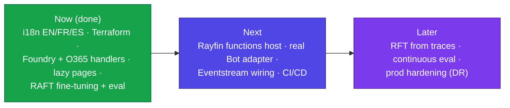

# Innovations & roadmap

This document captures **what makes the solution innovative today** and the
**evolutions still to build**. It complements [DEPLOYMENT.md](DEPLOYMENT.md)
(how it is deployed) and the root [README](../README.md) (what it is).

> Design guardrail across everything below: **mock-first**. The app runs fully
> offline on deterministic seed data; every real integration keeps a mock fallback
> gated by `isMock()`, so `npm run build` and `npm test` stay green with flags off.

## Innovations delivered

| Area | Innovation |
| --- | --- |
| **Governed data + AI** | One Fabric App unifies the ontology (Fabric SQL), governed Lakehouse, Fabric IQ semantic layer, Data Agent (NL2SQL) and real-time Eventhouse scoring. |
| **Identity passthrough** | Reads flow through Fabric with the signed-in analyst's identity, so **RLS and PII masking are enforced end to end** — no service-principal shortcuts. |
| **Foundry ↔ Fabric grounding** | Foundry Agent Service grounds on the Fabric Data Agent through a **connection with OBO** (no hand-rolled NL2SQL proxy on the real path). |
| **Connected multi-agent** | A triage orchestrator delegates to investigation / AML / claims agents; **only the orchestrator replies**, each sub-agent declares its role, models are matched to task for cost. |
| **Human-in-the-loop** | All AI output is advisory; every run and decision is written to `AgentRun` + the audit trail; **human approval is always required**. |
| **Closed remediation loop** | Risk threshold → alert → Teams approval card → analyst decision → **OneLake writeback** → retraining backlog → **RAFT model iteration** (the loop is now closed). |
| **RAFT (model iteration)** | An AML document corpus, a Foundry IQ knowledge base and RAFT notebooks train a fine-tuned **`gpt-4.1-mini`** student; a reproducible harness measures **baseline vs RAFT** (groundedness, retrieval, relevance + tokens/latency/cost) surfaced live in the app. |
| **Microsoft 365 (Work IQ)** | Teams approval cards, Outlook reports, SharePoint evidence and work-graph signals via **Microsoft Graph delegated/OBO** (least-privilege, no app/delegated mixing). |
| **Explainability** | Risk scores expose per-driver breakdowns; the "90 min → 30 sec" Fraud IQ scenario contrasts manual triage with a single grounded, explainable prompt. |
| **Localization** | Full UI in **English, French and Spanish** (react-i18next); agent output respects the active locale. |
| **Infrastructure as Code** | Terraform provisions the Azure support layer (Foundry, Key Vault, Event Hub, Log Analytics, Azure Bot, Function) with centralized naming and Key Vault–only secrets. |

## Architecture principles

- **Swappable service clients** — one class, a real path plus a deterministic mock,
  selected by config (mirrors `FabricDataAgentClient`).
- **Host-agnostic backend** — handlers carry no host binding, so they run on the
  native Rayfin `functions` service (preferred) or the Terraform Azure Function.
- **Model tiers via variables** — orchestrator (small/fast), reasoning (strong),
  extraction (small), embeddings — never hardcoded.

## Roadmap — evolutions to build

### Next
- **Activate the native Rayfin `functions` host.** Currently `enabled: false` because
  the functions folder/schema convention is not documented in the installed Rayfin
  guide (v1.33). The backend already runs as a standalone Azure Function; mount the
  same host-agnostic handlers on Rayfin functions once the convention is confirmed.
- **Real Bot Framework adapter** for the Teams `/api/messages` endpoint (proactive
  conversation references + card action auth), replacing the lightweight callback stub.
- **Eventstream ingestion** from the Terraform Event Hub into the Eventhouse (today the
  KQL seed uses an Azure-CLI identity; wire the managed identity + Eventstream source).
- **CI/CD** — build/test/lint gate for the SPA, `tsc` for the backend, `terraform plan`
  on PRs; deploy on tag.
- **Power BI ETL** — the semantic model expects 7 analytical tables; add the
  compatibility ETL from the 11 singular Lakehouse tables.

### Later
- **Reinforcement fine-tuning (RFT) from traces** on top of the shipped RAFT SFT pipeline,
  with **continuous evaluation** and token/agent monitoring (the RAFT eval harness is the
  starting point).
- **Production hardening** — private endpoints, zone redundancy, DR/failover, secret
  rotation, and full observability dashboards.
- **Domain-term localization** — enum values (Severity / AlertType / AlertStatus /
  Decision) are kept canonical today because they double as filter identifiers;
  add a display-mapping layer if fully localized labels are required.
- **Data Agent conversation API** — adopt it for in-app agent responses once the public
  Fabric REST surface exposes a conversation endpoint (today a grounded fallback is used).

## Known limitations (today)

- Rayfin `functions` host not activated (convention undocumented in v1.33).
- Real Foundry/Graph/OneLake handlers are wired and type-safe but return **simulated**
  results until the Azure resources + OBO consent are provisioned.
- Real-time KQL seeding needs an Azure-CLI/SP/MI identity (Kusto-audience token).
