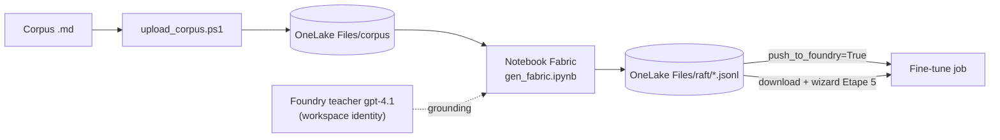
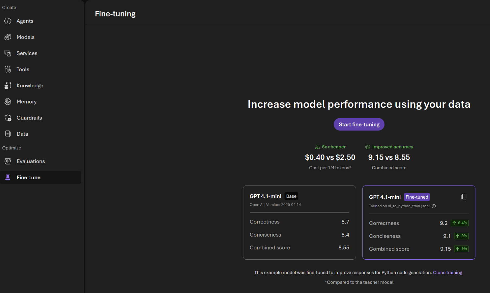
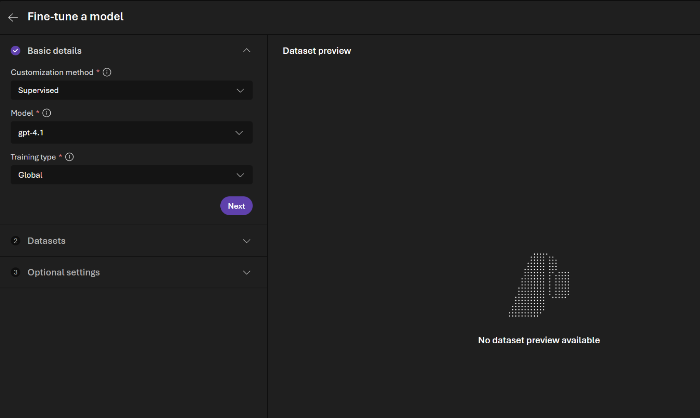
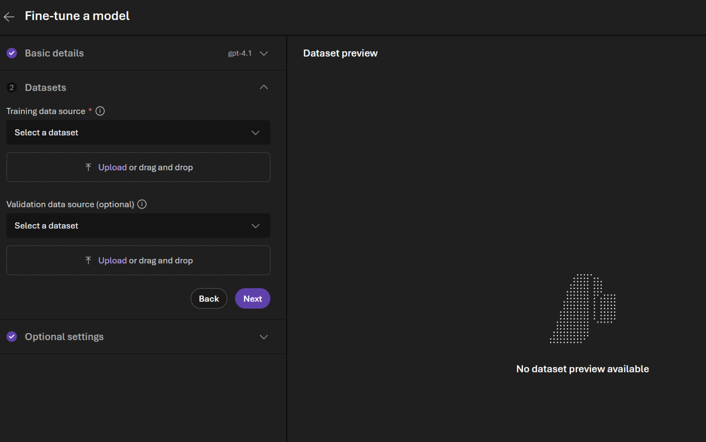
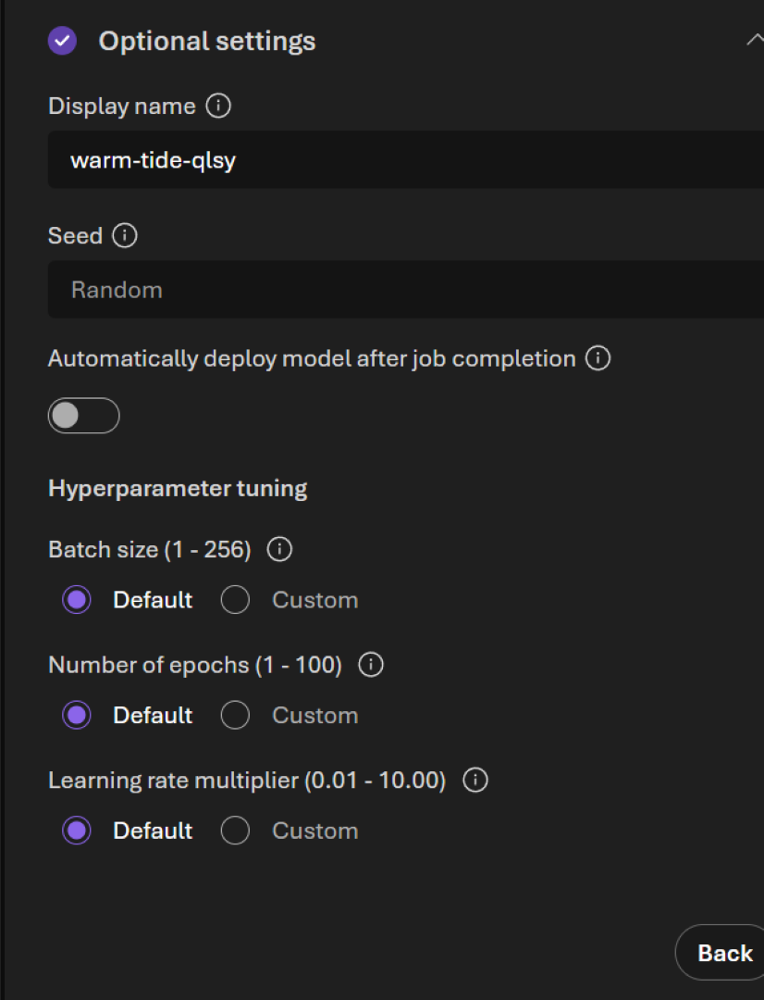
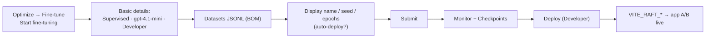

# Fine-tuning RAFT dans le portail Foundry — parcours 100 % UI

Guide pas-à-pas pour entraîner et déployer le **modèle affiné RAFT AML** (`gpt-4.1-mini`) entièrement
depuis le **portail Microsoft Foundry (new)**, sans notebook ni SDK. C'est l'équivalent UI de
[`foundry/raft/2_finetune.ipynb`](../foundry/raft/2_finetune.ipynb) (Option A) et
[`3_deploy.ipynb`](../foundry/raft/3_deploy.ipynb).

> **Captures d'écran.** Les captures de l'assistant proviennent du **portail Foundry réel** (tenant
> de démo, sous `docs/images/fine-tuning/`). Elles montrent un exemple `gpt-4.1` / **Global** ; pour
> RAFT la reco est **`gpt-4.1-mini`** + **Developer** (voir étapes 2 et 4). La bannière *New Foundry*
> reste une image Microsoft Learn. Réf. :
> [Customize a model with fine-tuning](https://learn.microsoft.com/azure/foundry/openai/how-to/fine-tuning?pivots=ai-foundry-portal).
> Vérifie toujours contre le portail live avant une démo.

---

## Prérequis

- **Toggle *New Foundry* activé** (bannière en haut du portail).

  

- Un **projet Foundry** et la ressource associée (`aif-fraudintel-<env>` — sortie Terraform
  `ai_foundry_name`).
- **Rôle** : le fine-tuning exige le rôle **Foundry Owner**. Un *Foundry User* peut entraîner mais
  **seul un AI Owner peut déployer** (ou un rôle personnalisé portant
  `Microsoft.CognitiveServices/accounts/deployments/write`). *(La vue « Azure OpenAI-centric »
  mentionne l'équivalent **Cognitive Services OpenAI Contributor**.)*
- **Région + quota** : `gpt-4.1-mini` est GA pour le SFT en **Sweden Central** et North Central US.
  Vérifie le quota dans la région cible **avant** de lancer.

---

## Étape 0 — Préparer les datasets JSONL

Le wizard attend deux fichiers **JSONL, format Chat Completions, UTF-8 avec BOM, < 512 Mo** :

```json
{"messages": [{"role": "system", "content": "You are an AML analyst assistant. Answer only from the provided documents. Cite the exact typology and rule..."}, {"role": "user", "content": "<DOCUMENT ...>\n\nQuestion: ..."}, {"role": "assistant", "content": "##Reason: ... ##Answer: ..."}]}
```

Trois façons de produire ces deux fichiers, du plus simple au plus industriel.

### Option 1 — Générer en local (SDK / papermill) — *recommandé pour la démo*

Le notebook [`foundry/raft/1_gen.ipynb`](../foundry/raft/1_gen.ipynb) lit le corpus AML
([`fabric/lakehouse/corpus/manifest.yaml`](../fabric/lakehouse/corpus/manifest.yaml)), assemble
chaque exemple (question + doc *golden* + distracteurs + réponse *teacher*) et écrit
`data/raft_train.jsonl` + `data/raft_val.jsonl` **déjà au bon format, avec BOM**.

```powershell
cd foundry/raft
uv sync                                              # ou: uv pip install --require-hashes -r requirements.txt
$env:AI_FOUNDRY_ENDPOINT = "https://<aif-fraudintel-env>.openai.azure.com/"
az login                                             # le teacher s'authentifie en AAD (aucune clé)
papermill 1_gen.ipynb out/1_gen.ipynb -f parameters/gpt-4.1-mini.yaml
```

Sans endpoint, le notebook tourne **à sec** (réponses *teacher* remplacées par un placeholder
déterministe) — pratique pour vérifier le format sans dépenser de tokens. Paramètres utiles dans
[`parameters/gpt-4.1-mini.yaml`](../foundry/raft/parameters/gpt-4.1-mini.yaml) : `n_questions`,
`n_distractors`, `oracle_probability` (proba de garder le doc golden — le reste apprend à
s'abstenir), `val_fraction`.

### Option 2 — À la main

Partir de 50+ exemples de qualité (le job accepte 10 minimum, mais c'est trop peu). Voir
[`data/raft_train.sample.jsonl`](../foundry/raft/data/raft_train.sample.jsonl) comme gabarit.

### Option 3 — Pipeline d'ingestion Fabric (OneLake)

Oui, c'est possible et cohérent avec le reste du repo : le corpus est **déjà** dans OneLake
(déposé par [`fabric/lakehouse/corpus/upload_corpus.ps1`](../fabric/lakehouse/corpus/upload_corpus.ps1)
sous `Files/corpus`). **Matérialisé** dans [`foundry/raft/fabric/`](../foundry/raft/fabric/) :

- [`gen_fabric.ipynb`](../foundry/raft/fabric/gen_fabric.ipynb) — jumeau OneLake-aware de `1_gen.ipynb` :
  lit `Files/corpus`, écrit `Files/raft/raft_train.jsonl` + `raft_val.jsonl`, avec une cellule
  optionnelle qui pousse directement à Foundry (`files.create`).
- [`deploy_pipeline.ps1`](../foundry/raft/fabric/deploy_pipeline.ps1) — importe le notebook comme item
  Fabric et crée/replace la **Data Pipeline** `raft-ingestion` (idempotent, Fabric REST).
- [`pipeline-content.json`](../foundry/raft/fabric/pipeline-content.json) — définition de la pipeline
  (une activité *Notebook*).



> **Le point à retenir** : le fine-tuning Foundry **n'entraîne pas directement depuis OneLake**. Les
> fichiers doivent être **uploadés** à la ressource (`files.create`) ou exister comme *dataset* projet.
> La pipeline Fabric automatise tout *jusqu'à* cet upload — ensuite soit `push_to_foundry=True`
> (100 % Fabric), soit tu télécharges les JSONL et tu les déposes à l'Étape 5. Détails + diagrammes
> dans [`foundry/raft/fabric/README.md`](../foundry/raft/fabric/README.md).

> **Règle d'or** : le **message système doit être identique** entre l'entraînement et l'inférence.
> S'il diffère au moment du déploiement, le modèle se comporte de façon imprévisible.

---

## Étape 1 — Ouvrir l'assistant

Dans la barre latérale gauche, section **Optimize → Fine-tune**, puis clique **Start fine-tuning**
(bouton violet **centré** dans le panneau, sous « Increase model performance using your data »).



> Les étapes 2 à 4 se règlent toutes dans le panneau **Basic details**, dans l'ordre affiché à
> l'écran : **Customization method**, puis **Model**, puis **Training type** ; on clique ensuite
> **Next** pour passer aux datasets.

## Étape 2 — Méthode de personnalisation (*Customization method*)

Choisir **Supervised** (RAFT est une technique SFT). *(DPO et RFT existent mais ne s'appliquent pas
ici ; aucun modèle GPT-5 ne supporte le SFT.)*

## Étape 3 — Modèle de base (*Model*)

Sélectionner **`gpt-4.1-mini`**. Pour du *continuous fine-tuning*, choisir plutôt un modèle déjà
affiné (`base-model.ft-{jobid}`) — c'est ainsi que la boucle de réentraînement devient itérative.

## Étape 4 — Type d'entraînement (*Training type*)

| Tier | Quand |
| --- | --- |
| **Developer** | Itération : capacité idle, ~50 % moins cher, préemptible (pas de SLA/résidence). |
| **Global** | Run final : moins cher que Standard, files plus rapides ; données/poids copiés hors région. |
| **Standard** | Si la **résidence des données** est requise (entraînement dans la région de la ressource). |

Recommandation : **Developer** pendant la mise au point, **Global** pour le run final. Puis **Next**.



> Sur la capture (exemple) : **Customization method** = `Supervised`, **Model** = `gpt-4.1`,
> **Training type** = `Global`. Pour RAFT, choisis **`gpt-4.1-mini`** + **Developer**.

## Étape 5 — Données d'entraînement et de validation

Panneau **Datasets** (les deux mêmes contrôles pour chaque source) :

- **Training data source** (obligatoire, `*`) et **Validation data source (optional)** : soit
  choisir un jeu déjà présent via le menu **Select a dataset**, soit envoyer `raft_train.jsonl` /
  `raft_val.jsonl` via la zone **Upload or drag and drop**.
- Le portail valide automatiquement : JSONL, UTF-8 **avec BOM**, < 512 Mo. Le volet **Dataset
  preview** (à droite) affiche « No dataset preview available » tant qu'aucun fichier n'est chargé.
- Boutons **Back** (retour à *Basic details*) et **Next** (vers *Optional settings*).



## Étape 6 — Paramètres optionnels



- **Display name** : nom du job/modèle résultant (le portail en génère un aléatoire, ex.
  `warm-tide-qlsy` sur la capture). Pour la démo, remplace-le par quelque chose de parlant comme
  `raft-aml`.
- **Seed** : `Random` par défaut ; fixe une valeur pour rendre le run reproductible.
- **Automatically deploy model after job completion** : désactivé sur la capture. À activer pour
  déployer automatiquement en cas de succès (supprime une étape manuelle). Nécessite le droit
  `deployments/write`.
- **Hyperparameter tuning** — trois réglages, chacun en **Default / Custom** (laisser **Default** au
  1er run) : **Batch size** (1–256), **Number of epochs** (1–100), **Learning rate multiplier**
  (0.01–10.00). Pour affiner ensuite : passer *Number of epochs* en **Custom = 2** et le
  *Learning rate multiplier* dans la plage 0,02–0,2.

## Étape 7 — Soumettre

**Submit**. Le job apparaît dans la table des fine-tunings ; il peut être mis en file. Durée :
minutes à heures selon le modèle et la taille du dataset (~1,5 h ici).

---

## Étape 8 — Suivre le job

Ouvrir **Job details** :

- **Monitor** : `train_loss` ↓, `full_valid_loss` ↓, `train_mean_token_accuracy` ↑. Si train et
  validation divergent → surapprentissage (réduire les epochs ou le learning-rate).
- **Checkpoints** : un checkpoint déployable est produit **à chaque epoch** ; les **3 derniers**
  restent disponibles (utile si un run surapprend). On peut **mettre en pause** un job *Running*
  (un checkpoint est créé après les évaluations de sécurité), puis reprendre.

---

## Étape 9 — Déployer le modèle affiné

Quand les métriques conviennent : sur la page du job, **Deploy** (nécessite Foundry Owner /
`deployments/write`).

- **Tier Developer** recommandé pour la démo : **pas de coût horaire d'hébergement**.
- **Attention coûts** :
  - Standard / Global Standard facturent **1,70 $/h quel que soit le trafic**.
  - Un déploiement Developer est **supprimé automatiquement après 24 h**.
  - Un déploiement (tout tier) inactif **> 15 jours** est supprimé (le modèle sous-jacent, lui,
    reste et peut être redéployé).
- Un modèle personnalisé n'autorise **qu'un seul déploiement** à la fois.

Alternative en une commande (matin de démo) :
[`foundry/raft/redeploy_student.ps1`](../foundry/raft/redeploy_student.ps1).

---

## Étape 10 — Brancher l'app (A/B live)

Une fois l'endpoint prêt, reporter le **nom du déploiement** dans la config de l'app :

```
VITE_RAFT_ENABLED=true
VITE_RAFT_STUDENT_DEPLOYMENT=raft-student
```

L'écran **AML Copilot** propose alors *Compare baseline vs RAFT* en **live** (sinon il reste sur
l'A/B mock déterministe, hors-ligne), et l'onglet **Settings → Model quality** affiche les scores.

---

## Étape 11 — Tester dans le Playground

Dans **Foundry → Playground**, sélectionner le déploiement affiné. **Réutiliser exactement le même
message système** que celui de l'entraînement — sinon le comportement dérive.

---

## Nettoyage

- Supprimer le **déploiement** : **Build → Models**.
- Supprimer le **modèle affiné** : page **Fine-tuning** (impossible tant qu'un déploiement existe).
- Supprimer les **fichiers** train/val/résultats si besoin.

---

## Récapitulatif du parcours UI



## Attribution des captures

Les captures de l'assistant (`docs/images/fine-tuning/foundry_*.png`) sont des **captures réelles du
portail Foundry** prises dans le tenant de démo. Seule la bannière *New Foundry* est une image
**Microsoft Learn** (© Microsoft, référencée par lien). Références :
[Customize a model with fine-tuning](https://learn.microsoft.com/azure/foundry/openai/how-to/fine-tuning?pivots=ai-foundry-portal)
· [When to use fine-tuning](https://learn.microsoft.com/azure/foundry/openai/concepts/fine-tuning-considerations).
Ce guide décrit la procédure vérifiée au 31/08/2026 ; le catalogue et l'UI évoluent — re-vérifier
avant toute présentation client.
