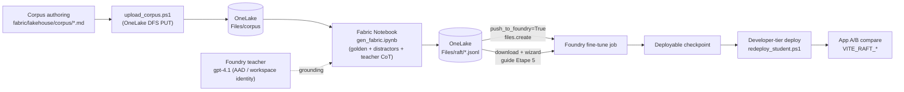
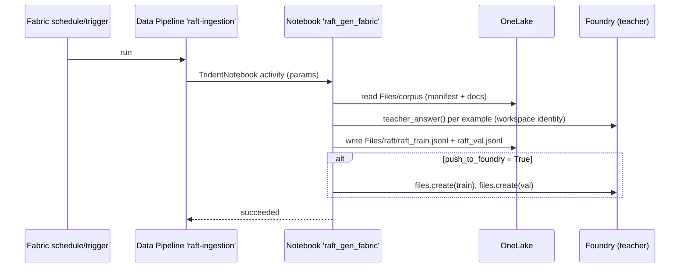

# RAFT ingestion on Fabric (OneLake)

Materialises **Option 3** of the fine-tuning guide: generate the RAFT training/validation datasets
**inside Fabric**, from the corpus that already lives in OneLake, and schedule it as a Data Pipeline.
This is the demo-grade, no-laptop path — the corpus never leaves OneLake and the run is repeatable.

| File | Role |
| --- | --- |
| [`gen_fabric.ipynb`](gen_fabric.ipynb) | OneLake-aware twin of [`../1_gen.ipynb`](../1_gen.ipynb). Reads `Files/corpus`, writes `Files/raft/*.jsonl`, optional `files.create` push to Foundry. |
| [`pipeline-content.json`](pipeline-content.json) | Data Pipeline definition — one *Notebook* activity (`{{NOTEBOOK_ID}}` / `{{WORKSPACE_ID}}` filled at deploy). |
| [`deploy_pipeline.ps1`](deploy_pipeline.ps1) | Imports the notebook as a Fabric item and creates/updates the pipeline (idempotent, Fabric REST + `az` token). |

## Why this shape

- **OneLake is both source and sink.** The corpus is uploaded once by
  [`fabric/lakehouse/corpus/upload_corpus.ps1`](../../../fabric/lakehouse/corpus/upload_corpus.ps1)
  to `Files/corpus`; the notebook writes `Files/raft/raft_train.jsonl` + `raft_val.jsonl` next to it.
  Nothing is copied out of the tenant to build the dataset.
- **A Notebook activity, not a Copy/Dataflow.** Building a RAFT example is *logic* (golden + distractor
  assembly, oracle probability, teacher call), not a column mapping — so the same Python as `1_gen.ipynb`
  runs unchanged; only the IO paths differ.
- **The upload to Foundry stays explicit.** Foundry fine-tuning **does not train directly from OneLake** —
  the training file must be uploaded to the resource (`files.create`) or exist as a project dataset. The
  notebook's last cell is that bridge (`push_to_foundry=True`); otherwise you download the JSONL from
  OneLake and drop it in the wizard (guide Étape 5).
- **Managed identity for the teacher.** In a scheduled run the notebook authenticates as the Fabric
  **workspace identity**; grant it `Cognitive Services OpenAI User` on the Foundry resource. No keys.
- **Still runs off-Fabric.** If `/lakehouse/default/Files/corpus` is not mounted, the notebook falls back
  to the repo corpus and writes to `data/` — so `papermill` and CI keep working with no capacity.

## Architecture



## Scheduled run (Data Pipeline)



## Deploy

```powershell
az login
cd foundry/raft/fabric
./deploy_pipeline.ps1 -Ws <workspace-guid>
```

Then, once, in the Fabric UI: **attach the Lakehouse** (the one holding `Files/corpus`) to the
`raft_gen_fabric` notebook, and grant the **workspace identity** `Cognitive Services OpenAI User` on the
Foundry resource. Run the `raft-ingestion` pipeline (or schedule it); output lands in `Files/raft/`.

## Cost & scope

- Teacher tokens: a few USD per full generation; Fabric compute is your capacity's.
- The dataset build is cheap. The money risk is the Stage 3 **hosting** fee — always deploy the student
  on the **Developer tier** (see [`../README.md`](../README.md)).
- Training domain stays **AML only**; the other domains remain distractors (see
  [`.github/instructions/raft.instructions.md`](../../../.github/instructions/raft.instructions.md)).
